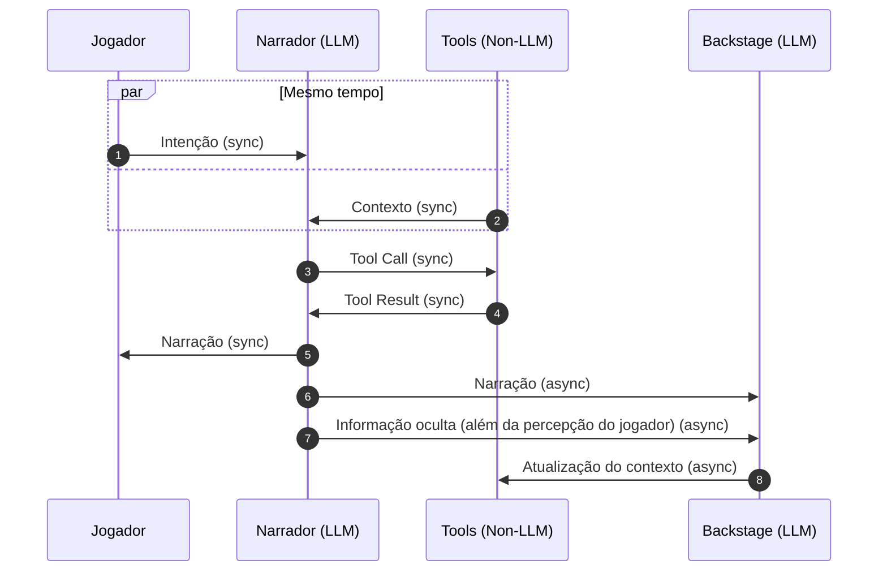

# Troca de mensagens: Jogador, Narrador, Engine

```mermaid
sequenceDiagram
    autonumber
    participant J as Jogador 
    participant N as Narrador (LLM)
    participant T as Tools (Non-LLM)
    participant R as Backstage (LLM)

    par Mesmo tempo
        J->>N: Intenção (sync)
    and
        T->>N: Contexto (sync)
    end

    N->>T: Tool Call (sync)
    T->>N: Tool Result (sync)

    N->>J: Narração (sync)
    N->>R: Narração (async)
    N->>R: Informação oculta (além da percepção do jogador) (async)

    R->>T: Atualização do contexto (async)

```
